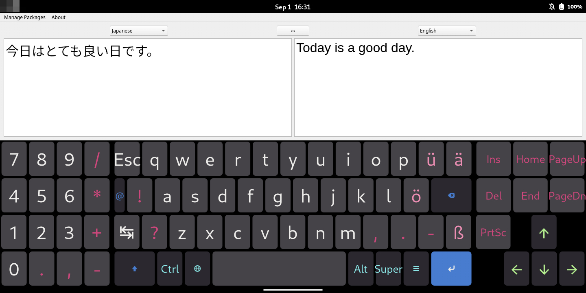

# pinephone
setup [pinephone](https://pine64.org/devices/pinephone/)

## install Two-Boot
- Two-Boot Installation instructions
    - Installing to eMMC Boot (recommended)
        - [https://tow-boot.org/devices/pine64-pinephoneA64.html](https://tow-boot.org/devices/pine64-pinephoneA64.html)
        - [https://github.com/Tow-Boot/Tow-Boot/releases](https://github.com/Tow-Boot/Tow-Boot/releases)

## install Mobian Phosh
- [https://images.mobian-project.org/pinephone/installer/weekly/](https://images.mobian-project.org/pinephone/installer/weekly/)

## setup
### install nftables

### install openssh-server

### change root password
```
sudo passwd root
```

### disable startup programs (optional)
- gnome-software
```
ls -l /etc/xdg/autostart/org.gnome.Software.desktop
sudo mv /etc/xdg/autostart/org.gnome.Software.desktop /etc/xdg/autostart/org.gnome.Software.desktop_bk
```
- geoclue-demo-agent
```
ls -l /etc/xdg/autostart/geoclue-demo-agent.desktop
sudo mv /etc/xdg/autostart/geoclue-demo-agent.desktop /etc/xdg/autostart/geoclue-demo-agent.desktop_bk
```

### disable panel
- panel-main-menu (ALT + F1)
```
gsettings set org.gnome.desktop.wm.keybindings panel-main-menu "[]"
```
- panel-run-dialog (ALT + F2)
```
gsettings set org.gnome.desktop.wm.keybindings panel-run-dialog "[]"
```

### disable tty terminal console (tty2 - tty6)
1. modify /etc/systemd/logind.conf
```
[Login]
NAutoVTs=0
ReserveVT=0
```
2. reboot pinephone

### enable faillock
1. modify /etc/security/faillock.conf
```
audit
silent
deny = 3
fail_interval = 180
unlock_time = 600
even_deny_root
root_unlock_time = 900
```
2. modify /etc/pam.d/common-auth
```
auth    required                        pam_faillock.so preauth
auth    [success=1 default=ignore]      pam_unix.so nullok
auth    [default=die]                   pam_faillock.so authfail
auth    sufficient                      pam_faillock.so authsucc
auth    requisite                       pam_deny.so
auth    required                        pam_permit.so
auth    optional                        pam_cap.so
```
3. modify /etc/pam.d/common-account
```
account required                        pam_faillock.so
account [success=1 new_authtok_reqd=done default=ignore]        pam_unix.so
account requisite                       pam_deny.so
account required                        pam_permit.so
```

### change scale setting (200% -> 100%)
1. modify /usr/share/phosh/phoc.ini file
```
#[core]
#xwayland=false

[output:DSI-1]
#scale = 2
scale = 1

[output:Virtual-1]
# For the x86 VM using QXL to get a phone like geometry
modeline = 87.25  720 776 848 976  1440 1443 1453 1493 -hsync +vsync
mode = 720x1440
#scale = 2
scale = 1

[output:X11-1]
#mode = 360x720
mode = 720x1440
#rotate = 90
scale = 1

[output:WL-1]
#mode = 360x720
mode = 720x1440
#rotate = 90
scale = 1

[output:HEADLESS-1]
mode = 720x1440
#rotate = 90
#scale = 2
scale = 1
```
2. reboot pinephone

### enable shuffled keypad on the lockscreen
- [How to enable shuffled keypad on the lockscreen](https://wiki.debian.org/Mobian/How-to#How_to_enable_shuffled_keypad_on_the_lockscreen)


### install input method (for japanese)
> [!CAUTION]
> You are not able to display virtual keyboard when you enter pin and application search, if you perform this setting.
1. install gnome-tweaks
```
sudo apt update
sudo apt upgrade -y
sudo apt install gnome-tweaks
```
2. install fcitx5-kkc
```
sudo apt install fcitx5-kkc gnome-shell-extension-kimpanel
```
3. enable phosh.service (display manager)
```
sudo systemctl status phosh.service
sudo systemctl enable phosh.service
```
4. disable gtk3.service (display manager)
```
sudo systemctl status gdm3.service
sudo systemctl disable gdm3.service
```
5. add the following variables to ~/.profile file
- ~/.profile
```
# fcitx5
export XMODIFIERS=@im=fcitx
export QT_IM_MODULE=fcitx
export GTK_IM_MODULE=fcitx
```
6. reboot pinephone
7. run Fcitx 5 Configuration application
8. add Kana Kanji to Current Input Method
9. run Tweaks application
10. add Fcitx 5 to Startup Applications
11. reboot pinephone

### install custom squeekboard layout
- [Ick/Squeekboard-Layouts](https://codeberg.org/Ick/Squeekboard-Layouts)
    - Manual Install
- [squeekboard](https://gitlab.gnome.org/World/Phosh/squeekboard)
- [Welcome to squeekboard’s documentation!](https://world.pages.gitlab.gnome.org/Phosh/squeekboard/index.html)
    - [A guide to creating layouts](https://world.pages.gitlab.gnome.org/Phosh/squeekboard/tutorial.html)
- [Librem5 - A custom squeekboard keyboard tutorial](https://forums.puri.sm/t/librem5-a-custom-squeekboard-keyboard-tutorial/17243)
- [Using non-latin language on Librem 5](https://forums.puri.sm/t/using-non-latin-language-on-librem-5/7103)

### install pyenv
- [pyenv](https://github.com/pyenv/pyenv)

### install argos translate gui
- [argos-translate](https://github.com/argosopentech/argos-translate)
- [argos-translate-gui](https://github.com/argosopentech/argos-translate-gui)

#### install argos translate gui
1. Turn off suspend setting
    - Settings > Power > Automatic Suspend
        - On Battery Power > Off
        - Plugged In > Off
2. plug in pinephone
3. install python 3.8.19 using pyenv
```
pyenv global system
pyenv local system

pyenv install 3.8.19
    
pyenv global 3.8.19
pyenv local 3.8.19
```
4. run install_argostranslategui.sh
> [!CAUTION]
> In the case of pinephone, this installation takes about 6 hours.
>
> In some cases, it takes longer than that.
- install_argostranslategui.sh
```
#!/bin/bash

pip3 install torch==1.13.0 torchvision==0.13.0 torchaudio==0.13.0 --index-url https://download.pytorch.org/whl/cpu --verbose
pip3 install pyqt5 --config-settings --confirm-license= --verbose
pip3 install argostranslategui
```
- pyenv version
```
$ pyenv versions
  system
* 3.8.19 (set by /home/mobian/.python-version)
```
- pip list
```
$ pip list
Package            Version
------------------ ---------
argostranslate     1.9.6
argostranslategui  1.6.5
certifi            2022.12.7
charset-normalizer 2.1.1
click              8.1.7
ctranslate2        4.3.1
idna               3.4
joblib             1.4.2
numpy              1.24.4
packaging          24.1
pillow             10.2.0
pip                23.0.1
protobuf           5.28.0
PyQt5              5.15.11
PyQt5_sip          12.15.0
PyYAML             6.0.2
regex              2024.7.24
requests           2.28.1
sacremoses         0.0.53
sentencepiece      0.2.0
setuptools         56.0.0
six                1.16.0
stanza             1.1.1
torch              1.13.0
torchaudio         0.13.0
torchvision        0.13.0
tqdm               4.66.5
typing_extensions  4.9.0
urllib3            1.26.13

[notice] A new release of pip is available: 23.0.1 -> 24.2
[notice] To update, run: pip install --upgrade pip
```
5. run argostranslategui (performance test)
```
argos-translate-gui
```
> [!NOTE]
> To perform a translation, you need to download the language packages data using Manage Packages.
>
> The size of the language packages data is approximately 11GB (~/.local/share/argos-translate/packages directory).
6. create argostranslategui.desktop file
- ~/.local/share/applications/argostranslategui.desktop
```
#!/usr/bin/env python3
[Desktop Entry]
Version=1.0
Type=Application
Terminal=false
Exec=/home/mobian/.pyenv/shims/argos-translate-gui      # change username (mobian)
Name=argos-translate-gui
Comment=argos translate gui
Icon=view-dual-symbolic                                 # optional
Categories=Utility;
```
7. run argostranslategui application from app grid (performance test)

#### change font size of argos translate gui
1. modify ~/.pyenv/versions/3.8.19/lib/python3.8/site-packages/argostranslategui/gui.py
- [https://github.com/argosopentech/argos-translate-gui/blob/main/argostranslategui/gui.py#L344](https://github.com/argosopentech/argos-translate-gui/blob/main/argostranslategui/gui.py#L344)
```
# TextEdits
self.left_textEdit = QTextEdit()
self.left_textEdit.setPlainText("Text to translate from")

self.left_textEdit.setFont(QFont('Arial', 24))              # add

self.left_textEdit.textChanged.connect(self.translate)
self.right_textEdit = QTextEdit()

self.right_textEdit.setFont(QFont('Arial', 24))             # add

self.right_textEdit.setPlainText("Text to translate to")
self.textEdit_layout = QHBoxLayout()
self.textEdit_layout.addWidget(self.left_textEdit)
self.textEdit_layout.addWidget(self.right_textEdit)
```
2. run argostranslategui application (performance test)


#### change from normal mode to dark mode
1. modify ~/.pyenv/versions/3.8.19/lib/python3.8/site-packages/argostranslategui/gui.py
- [https://github.com/argosopentech/argos-translate-gui/blob/main/argostranslategui/gui.py#L450](https://github.com/argosopentech/argos-translate-gui/blob/main/argostranslategui/gui.py#L450)
```
class GUIApplication:
    def __init__(self):
        self.app = QApplication([])
        self.main_window = GUIWindow()

        # dark mode https://stackoverflow.com/questions/48256772/dark-theme-for-qt-widgets
        self.app.setStyle("Fusion")                                       # add
        palette = QPalette()                                              # add
        palette.setColor(QPalette.Window, QColor(53, 53, 53))             # add
        palette.setColor(QPalette.WindowText, Qt.white)                   # add
        palette.setColor(QPalette.Base, QColor(25, 25, 25))               # add
        palette.setColor(QPalette.AlternateBase, QColor(53, 53, 53))      # add
        palette.setColor(QPalette.ToolTipBase, Qt.black)                  # add
        palette.setColor(QPalette.ToolTipText, Qt.white)                  # add
        palette.setColor(QPalette.Text, Qt.white)                         # add
        palette.setColor(QPalette.Button, QColor(53, 53, 53))             # add
        palette.setColor(QPalette.ButtonText, Qt.white)                   # add
        palette.setColor(QPalette.BrightText, Qt.red)                     # add
        palette.setColor(QPalette.Link, QColor(42, 130, 218))             # add
        palette.setColor(QPalette.Highlight, QColor(42, 130, 218))        # add
        palette.setColor(QPalette.HighlightedText, Qt.black)              # add
        self.app.setPalette(palette)                                      # add

        # Icon
```
2. run argostranslategui application

### customize lockscreen and app grid
#### set a background for lockscreen and app grid
- [How To: set up custom lock screen and app-grid for Phosh based systems](https://forum.pine64.org/showthread.php?tid=14292)

#### set font size for lockscreen
1. add the following code to gtk.css file
- ~/.config/gtk-3.0/gtk.css
```
#phosh-lockscreen-clock {
  font-size: 100px;
/*  color: blue;*/
}

#phosh-lockscreen-date {
  font-size: 24px;
/*  color: blue;*/
}
```
2. reboot pinephone

#### set characters color for top panel
1. add the following code to gtk.css file
- ~/.config/gtk-3.0/gtk.css
```
phosh-top-panel {
  color: blue;
}
```
2. reboot pinephone

#### find out css node and selector for Phosh
- [Developing for Mobile Linux with Phosh - Part 0: Running nested](https://phosh.mobi/posts/phosh-dev-part-0/)
- [CSS Properties](https://docs.gtk.org/gtk3/css-properties.html)


### customize Phoc and Phosh
> [!CAUTION]
> Phoc and Phosh files return to the original state when you update them. (e.g. apt upgrade)
>
> You need to customize them again.
- [Phoc](https://gitlab.gnome.org/World/Phosh/phoc)
```
mkdir ~/git
cd ~/git
git clone https://gitlab.gnome.org/World/Phosh/phoc
cd phoc

git branch myphoc
git checkout myphoc

sudo apt-get -y install build-essential
sudo apt-get -y build-dep .

meson setup _build
meson compile -C _build

sudo mv /usr/bin/phoc /usr/bin/phoc_orig
sudo cp -rp ~/git/phoc/_build/src/phoc /usr/bin/phoc
sudo chown root:root /usr/bin/phoc
sudo chmod 755 /usr/bin/phoc
sudo strip -s /usr/bin/phoc
ls -l /usr/bin/phoc

sudo reboot
```

- [Phosh](https://gitlab.gnome.org/World/Phosh/phosh)
```
mkdir ~/git
cd ~/git
git clone https://gitlab.gnome.org/World/Phosh/phosh
cd phosh
git submodule update --init --recursive

git branch myphosh
git checkout myphosh

sudo apt-get -y install build-essential
sudo apt-get -y build-dep .

meson setup _build
meson compile -C _build

sudo mv /usr/libexec/phosh /usr/libexec/phosh_orig
strip -s ~/git/phosh/_build/src/phosh
sudo cp -rp ~/git/phosh/_build/src/phosh /usr/libexec/phosh
sudo chown root:root /usr/libexec/phosh
sudo chmod 755 /usr/libexec/phosh
ls -l /usr/libexec/phosh

sudo reboot
```

#### invisible search bar on the app grid
- Phosh
1. modify phosh/src/ui/app-grid.ui
```
diff --git a/src/ui/app-grid.ui b/src/ui/app-grid.ui
index 03b66485..6feb8241 100644
--- a/src/ui/app-grid.ui
+++ b/src/ui/app-grid.ui
@@ -20,7 +20,7 @@
                 <property name="visible">True</property>
                 <child>
                   <object class="GtkSearchEntry" id="search">
-                    <property name="visible">True</property>
+                    <property name="visible">False</property>
                     <property name="placeholder-text" translatable="yes">Search apps<E2><80><A6></property>
```
2. build
```
cd ~/git/phosh
meson compile -C _build

sudo mv /usr/libexec/phosh /usr/libexec/phosh_
strip -s ~/git/phosh/_build/src/phosh
sudo cp -rp ~/git/phosh/_build/src/phosh /usr/libexec/phosh
sudo chown root:root /usr/libexec/phosh
sudo chmod 755 /usr/libexec/phosh
ls -l /usr/libexec/phosh
sudo rm /usr/libexec/phosh_
```
3. reboot pinephone

#### enable shuffled keypad on the lockscreen
- Phosh
1. modify phosh/data/sm.puri.phosh.gschema.xml
```
diff --git a/data/sm.puri.phosh.gschema.xml b/data/sm.puri.phosh.gschema.xml
index fe0bcc37..61841454 100644
--- a/data/sm.puri.phosh.gschema.xml
+++ b/data/sm.puri.phosh.gschema.xml
@@ -121,7 +121,7 @@
   <schema id="sm.puri.phosh.lockscreen"
           path="/sm/puri/phosh/lockscreen/">
     <key name="shuffle-keypad" type="b">
-      <default>false</default>
+      <default>true</default>
       <summary>Whether to scramble the keypad</summary>
```
2. build
```
cd ~/git/phosh
meson compile -C _build

sudo mv /usr/libexec/phosh /usr/libexec/phosh_
strip -s ~/git/phosh/_build/src/phosh
sudo cp -rp ~/git/phosh/_build/src/phosh /usr/libexec/phosh
sudo chown root:root /usr/libexec/phosh
sudo chmod 755 /usr/libexec/phosh
ls -l /usr/libexec/phosh
sudo rm /usr/libexec/phosh_
```
3. reboot pinephone

#### shutdown pinephone if the wrong pin is entered 3 times in a row on the keypad
- Phosh
1. modify phosh/src/lockscreen.c (check auth count and shutdown pinephone)
```
diff --git a/src/lockscreen.c b/src/lockscreen.c
index ef00ea27..6bd62d44 100644
--- a/src/lockscreen.c
+++ b/src/lockscreen.c
@@ -115,6 +115,8 @@ typedef struct {
 
 G_DEFINE_TYPE_WITH_PRIVATE (PhoshLockscreen, phosh_lockscreen, PHOSH_TYPE_LAYER_SURFACE)
 
+static int auth_count = 0;
+
 
 static void
 phosh_lockscreen_set_property (GObject      *object,
@@ -260,6 +262,7 @@ auth_async_cb (PhoshAuth *auth, GAsyncResult *result, PhoshLockscreen *self)
   gboolean authenticated;
 
   priv = phosh_lockscreen_get_instance_private (self);
+  auth_count++;
   authenticated = phosh_auth_authenticate_finish (auth, result, &error);
   if (error != NULL) {
     g_warning ("Auth failed unexpected: %s", error->message);
@@ -267,12 +270,21 @@ auth_async_cb (PhoshAuth *auth, GAsyncResult *result, PhoshLockscreen *self)
   }
 
   if (authenticated) {
+    auth_count = 0;
     g_signal_emit (self, signals[LOCKSCREEN_UNLOCK], 0);
   } else {
-    /* give visual feedback on error */
-    phosh_lockscreen_set_unlock_status (self, _("Enter Passcode"));
-    phosh_lockscreen_shake_pin_entry (self);
-    phosh_keypad_distribute (PHOSH_KEYPAD (priv->keypad));
+    if (auth_count < 3){
+      /* give visual feedback on error */
+      phosh_lockscreen_set_unlock_status (self, _("Enter Passcode"));
+      phosh_lockscreen_shake_pin_entry (self);
+      phosh_keypad_distribute (PHOSH_KEYPAD (priv->keypad));
+    } else {
+      /* shutdown */
+      phosh_lockscreen_set_unlock_status (self, _("Shutdown"));
+      phosh_session_manager_shutdown(phosh_shell_get_session_manager (phosh_shell_get_default ()));
+      return;
+    }
   }
```
2. modify phosh/src/ui/end-session-dialog.ui (make a cancel button invisible on a dialog)
```
diff --git a/src/ui/end-session-dialog.ui b/src/ui/end-session-dialog.ui
index 9a41c0bb..f07cb6c4 100644
--- a/src/ui/end-session-dialog.ui
+++ b/src/ui/end-session-dialog.ui
@@ -60,7 +60,7 @@
     <child type="phosh-dialog-button">
       <object class="GtkButton" id="btn_cancel">
         <property name="label" translatable="yes">Cancel</property>
-        <property name="visible">True</property>
+        <property name="visible">False</property>
         <property name="can-focus">True</property>
```
3. modify phosh/src/session-manager.c (change timeout of the dialog to 5 seconds)
```
diff --git a/src/session-manager.c b/src/session-manager.c
index fb66f3b2..fa3b7aed 100644
--- a/src/session-manager.c
+++ b/src/session-manager.c
@@ -129,6 +129,7 @@ handle_end_session_open (PhoshDBusEndSessionDialog *object,
       return TRUE;
   }
 
+  arg_seconds_to_stay_open = 5;
   self->dialog = PHOSH_END_SESSION_DIALOG (phosh_end_session_dialog_new (arg_type,
                                                                          arg_seconds_to_stay_open,
                                                                          arg_inhibitor_object_paths));
```
4. build
```
cd ~/git/phosh
meson compile -C _build

sudo mv /usr/libexec/phosh /usr/libexec/phosh_
strip -s ~/git/phosh/_build/src/phosh
sudo cp -rp ~/git/phosh/_build/src/phosh /usr/libexec/phosh
sudo chown root:root /usr/libexec/phosh
sudo chmod 755 /usr/libexec/phosh
ls -l /usr/libexec/phosh
sudo rm /usr/libexec/phosh_
```
5. reboot pinephone

#### display virtual keyboard for application search and lockscreen
> [!WARNING]
> You are able to display virtual keyboard for application search and lockscreen using powerbar and keyboard button, if you perform this customization.
> 
> However, to hide the keyboard again, you need to press the powerbar button.
- Phoc
1. modify phoc/src/layer-shell.c (reference:[https://gitlab.gnome.org/World/Phosh/phoc/-/issues/302](https://gitlab.gnome.org/World/Phosh/phoc/-/issues/302))
```
diff --git a/src/layer-shell.c b/src/layer-shell.c
index c8d92d5..556613e 100644
--- a/src/layer-shell.c
+++ b/src/layer-shell.c
@@ -792,8 +792,9 @@ phoc_layer_shell_update_osk (PhocOutput *output, gboolean arrange)
       continue;
 
     g_assert (PHOC_IS_SEAT (seat));
-    if (seat->focused_layer->pending.layer >= osk->layer_surface->pending.layer &&
-        phoc_input_method_relay_is_enabled (&seat->im_relay, seat->focused_layer->surface)) {
+//    if (seat->focused_layer->pending.layer >= osk->layer_surface->pending.layer &&
+//        phoc_input_method_relay_is_enabled (&seat->im_relay, seat->focused_layer->surface)) {
+    if (seat->focused_layer->pending.layer >= osk->layer_surface->pending.layer) {
       force_overlay = TRUE;
       break;
     }
```
2. build
```
cd ~/git/phoc
meson compile -C _build

sudo mv /usr/bin/phoc /usr/bin/phoc_
sudo cp -rp ~/git/phoc/_build/src/phoc /usr/bin/phoc
sudo chown root:root /usr/bin/phoc
sudo chmod 755 /usr/bin/phoc
sudo strip -s /usr/bin/phoc
ls -l /usr/bin/phoc
sudo rm /usr/bin/phoc_
```

- Phosh
1. modify phosh/src/lockscreen.c
```
@@ -241,10 +243,27 @@ static void
 focus_pin_entry (PhoshLockscreen *self, gboolean enable_osk)
 {
   PhoshLockscreenPrivate *priv = phosh_lockscreen_get_instance_private (self);
+  PhoshOskManager *osk;
+  gboolean osk_is_available, osk_current_state, osk_new_state;
 
   if (enable_osk) {
     /* restore default OSK behavior */
-    g_object_set (priv->entry_pin, "im-module", NULL, NULL);
+//    g_object_set (priv->entry_pin, "im-module", NULL, NULL);
+
+    osk = phosh_shell_get_osk_manager (phosh_shell_get_default ());
+
+    osk_is_available = phosh_osk_manager_get_available (osk);
+    osk_current_state = phosh_osk_manager_get_visible (osk);
+    osk_new_state = osk_current_state;
+
+    if (osk_is_available) {
+      osk_new_state = !osk_current_state;
+    } else {
+      return;
+    }
+
+    phosh_osk_manager_set_visible (osk, osk_new_state);
+
   }

@@ -310,13 +338,31 @@ on_osk_visibility_changed (PhoshLockscreen *self,
                            PhoshOskManager *osk)
 {
   PhoshLockscreenPrivate *priv;
+  gboolean osk_is_available, osk_current_state, osk_new_state;
 
   g_assert (PHOSH_IS_LOCKSCREEN (self));
   priv = phosh_lockscreen_get_instance_private (self);
 
   if (!phosh_osk_manager_get_visible (osk)) {
-    g_object_set (priv->entry_pin, "im-module", "gtk-im-context-none", NULL);
+//    g_object_set (priv->entry_pin, "im-module", "gtk-im-context-none", NULL);
+
+      osk = phosh_shell_get_osk_manager (phosh_shell_get_default ());
+
+      osk_is_available = phosh_osk_manager_get_available (osk);
+      osk_current_state = phosh_osk_manager_get_visible (osk);
+      osk_new_state = osk_current_state;
+
+      if (osk_is_available) {
+        osk_new_state = !osk_current_state;
+      } else {
+        return;
+      }
+
+      phosh_osk_manager_set_visible (osk, osk_new_state);
   }
+
+  gtk_widget_set_sensitive (priv->entry_pin, TRUE);
+  gtk_entry_grab_focus_without_selecting (GTK_ENTRY (priv->entry_pin));
 }
```
2. build
```
cd ~/git/phosh
meson compile -C _build

sudo mv /usr/libexec/phosh /usr/libexec/phosh_
strip -s ~/git/phosh/_build/src/phosh
sudo cp -rp ~/git/phosh/_build/src/phosh /usr/libexec/phosh
sudo chown root:root /usr/libexec/phosh
sudo chmod 755 /usr/libexec/phosh
ls -l /usr/libexec/phosh
sudo rm /usr/libexec/phosh_
```
3. disable phosh.service and enable gdm3.service (optional)
> [!NOTE]
> You may not be able to login due to trouble. (e.g. apt upgrade)
> 
> When starting up, login using gdm3 login manager. (select phosh from gear icon and login)
```
sudo systemctl status phosh.service
sudo systemctl disable phosh.service

sudo systemctl status gdm3.service
sudo systemctl enable gdm3.service
```
If you can't enable gdm3.service, you need to modify /lib/systemd/system/gdm3.service file.
[https://askubuntu.com/questions/1361285/cant-enable-gdm3-after-following-a-tutorial-on-how-to-remove-kde-from-ubuntu](https://askubuntu.com/questions/1361285/cant-enable-gdm3-after-following-a-tutorial-on-how-to-remove-kde-from-ubuntu)

4. reboot pinephone

#### restore to original state
- Phoc
1. restore the original file
```
ls -l /usr/bin/phoc
sudo rm /usr/bin/phoc

sudo mv /usr/bin/phoc_orig /usr/bin/phoc
ls -l /usr/bin/phoc
```
2. reboot pinephone

- Phosh
1. restore the original file
```
ls -l /usr/libexec/phosh
sudo rm /usr/libexec/phosh

sudo mv /usr/libexec/phosh_orig /usr/libexec/phosh
ls -l /usr/libexec/phosh
```
2. reboot pinephone

